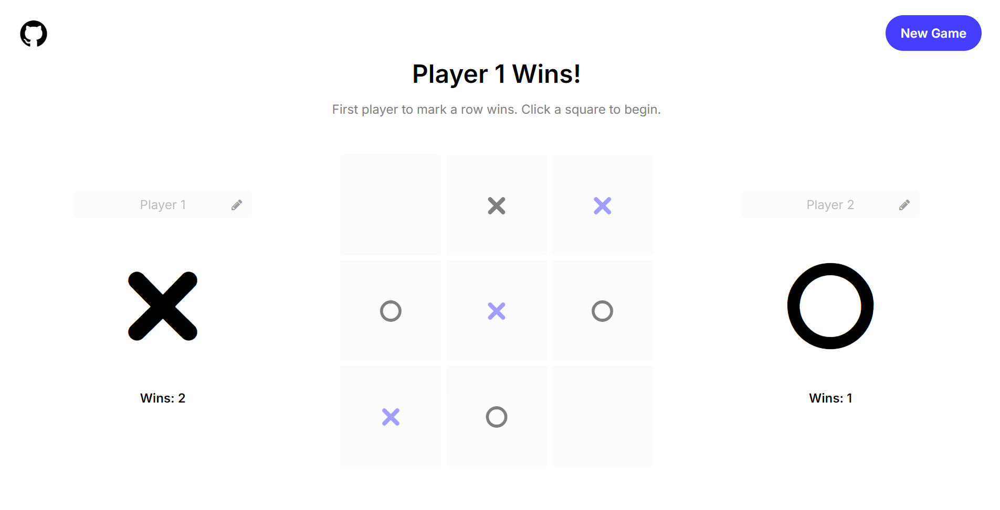

# Tic Tac Toe

The Odin Project - JavaScript Course Project 2:

Creating an interactive Tic Tac Toe game for the web using HTML, CSS and JavaScript.

## Preview

## Links

Live Link: https://luciavu.github.io/tic-tac-toe/

Assignment: https://www.theodinproject.com/lessons/node-path-javascript-tic-tac-toe

## Credits

Icons from Fontello: https://fontello.com/
